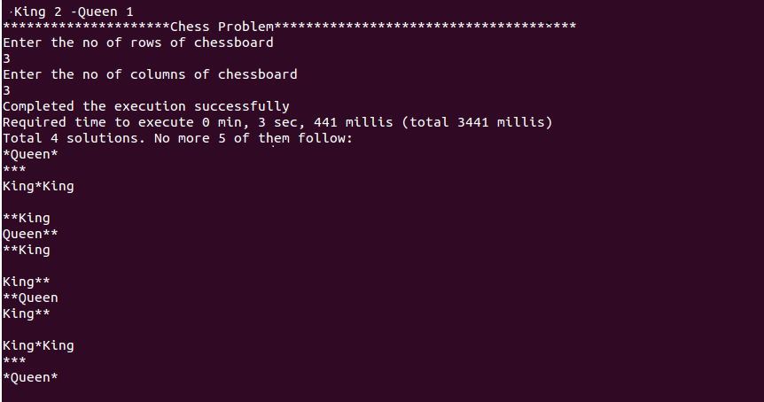

# Chess Problem 

Table of contents
=================

  * [Problem Statement ](#problem-statement)
  * [System requierments](#system-requierments)
  * [Steps to build](#steps-to-build)
  * [Steps to run](#steps-to-run)
  * [Steps to run unit Spec](#steps-to-run-unit-spec)
  * [Running evaluation](#running-evaluation)
  * [Expected Output](#expected-output)
  

## Problem Statement 

The problem is to find all unique configurations of a set of normal chess pieces on a chess board with dimensions M?N where none of the pieces 
is in a position to take any of the others. Providing the number of results is useful, but not enough to complete the assignment. Assume the 
colour of the piece does not matter, and that there are no pawns among the pieces.

Write a program which takes as input:

 * The dimensions of the board: M, N

 * The number of pieces of each type (King, Queen, Bishop, Rook and Knight) to try and place on the board.

As output, the program should list all the unique configurations to the console for which all of the pieces can be placed on the board without 
threatening each other.When returning your solution, please provide with your answer the total number of unique configurations for a 7?7 board 
with 2 Kings, 2 Queens, 2 Bishops and 1 Knight. Also provide the time it took to get the final score. Needless to say, the lower the time, 
the better.

## System Requirements 
 * Java Runtime Environment above 7 (http://www.oracle.com/technetwork/indexes/downloads/index.html#java)
 * sbt (http://www.scala-sbt.org/0.13/docs/Installing-sbt-on-Linux.html)

## Steps to Build 
 * clone the git repo 
 * go to root folder of the project 
 * Run command `sbt compile`
 * Run command `sbt pack or sbt packArchive`

## Steps to run Unit Spec
 * sbt test

## Steps to Run 
 * go to <ROOT_PROJECT_DIR>/target/pack
 * Run `./bin/chessSolver` OR `./bin/chessSolver -King 2 -Queen 1 -Rook 3`
 
## Running Evaluation 
This program approx takes 6-20 s to complete 

## Expected Output 

